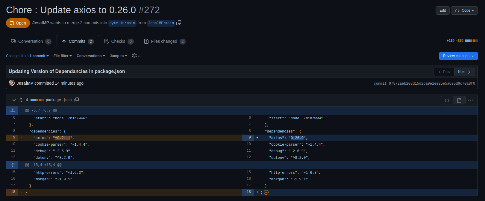

[](https://classroom.github.com/online_ide?assignment_repo_id=7942927&assignment_repo_type=AssignmentRepo)
<div id="top"></div>
<!--
*** Thanks for checking out the Best-README-Template. If you have a suggestion
*** that would make this better, please fork the repo and create a pull request
*** or simply open an issue with the tag "enhancement".
*** Don't forget to give the project a star!
*** Thanks again! Now go create something AMAZING! :D
-->


<!-- PROJECT SHIELDS -->
<!--
*** I'm using markdown "reference style" links for readability.
*** Reference links are enclosed in brackets [ ] instead of parentheses ( ).
*** See the bottom of this document for the declaration of the reference variables
*** for contributors-url, forks-url, etc. This is an optional, concise syntax you may use.
*** https://www.markdownguide.org/basic-syntax/#reference-style-links
-->
[![MIT License][license-shield]][license-url]
[![LinkedIn][linkedin-shield]][linkedin-url]


<!-- PROJECT LOGO -->
<br />
<div align="center">
  <a href="https://github.com/github_username/repo_name">
    
  </a>

<h3 align="center">SDK CLI Tool to Update Dependancies in a Project To a Specified Version</h3>

  <p align="center">
    This CLI tool is used to manage dependencies in a Node.js Project, update its version adn create Pull Requests accordingly.
    <br />
    <a href="https://github.com/dyte-submissions/dyte-vit-2022-JesalMP"><strong>Explore the docs »</strong></a>
    <br />
    <br />
  </p>
</div>


<!-- TABLE OF CONTENTS -->
<details>
  <summary>Table of Contents</summary>
  <ol>
    <li>
      <a href="#about-the-project">About The Project</a>
      <ul>
        <li><a href="#built-with">Built With</a></li>
      </ul>
    </li>
    <li>
      <a href="#getting-started">Getting Started</a>
      <ul>
        <li><a href="#prerequisites">Prerequisites</a></li>
        <li><a href="#installation">Installation</a></li>
      </ul>
    </li>
    <li><a href="#usage">Usage</a></li>
    <li><a href="#roadmap">Roadmap</a></li>
    <li><a href="#contributing">Contributing</a></li>
    <li><a href="#license">License</a></li>
    <li><a href="#contact">Contact</a></li>
    <li><a href="#acknowledgments">Acknowledgments</a></li>
  </ol>
</details>


<!-- ABOUT THE PROJECT -->
## About The Project


This Project is a Basic CLI tool written in Python 3.10 to manage and update the dependencies in a Node.js project hosted on github.com. With its various features, one can find if some dependencies of the project are deprecated with respect to a certain version, create a fork of the project and update the dependancies if wanted, and create a PULL Request to the main proj thereafter.

<p align="right">(<a href="#top">back to top</a>)</p>


### Built With

* [Python](https://www.python.org/)

<p align="right">(<a href="#top">back to top</a>)</p>


<!-- GETTING STARTED -->
## Getting Started

First things first, to use this CLI, one must obviously have installed Latest Python 3.10 (https://www.python.org/downloads/), pip pythong package manager, nodejs and npm installed. The latter two can be installed by
- ```sh
  sudo apt-get install npm nodejs python3-pip
  ```


### Prerequisites

There are some other npm and python libraries also required, assuming the pip package manager is already running and setup in the Linux Environment, install the following packages by running the commands (If some packages are already installed, do not panik, they will be skipped).

- ```sh
  sudo pip install tabulate apturl urllib3 halo pandas pyfiglet packaging
  ```
- ```sh
  sudo npm install husky
  ```

### Installation

1. Download the code as zip or clone the repo.
2. In the project root directory, go to env folder and open "config.py" with any text editor.
3. In config.py, enter your Github Username in "user_name" variable, Github email id in "user_mailid" variable.
4. In your Github account, Go to Settings -> Developer Settings -> Personal Access Tokens , and generate a new token with all boxes ticked.
5. In "config.py" we opened in step 3, enter the token we generated in step 4 in "token" variable.
6. We are Good to Go.


<p align="right">(<a href="#top">back to top</a>)</p>


<!-- USAGE EXAMPLES -->
## Usage
1. Go to Project Root Dir, Let this directory be /rootDir/.
2. Thus, our project directory will be something like
```sh
rootDir
├── CHANGELOG.md
├── DependancyUpdater.py
├── env
│   └── config.py
├── images  
│   └── MISC IMAGES
├── info.csv
├── LICENSE.txt
├── output.csv
├── README.md
├── temp
└── utils
    └── functions.py

  ```
3. Open a Terminal in rootDir.
4. To view the arguements and parameters of the UpdateDependency.py file, run 
- ```sh
  python3 DependancyUpdater.py -h
  ```
5. You will be greeted by the same Output as in the Logo image, (The very first image in readme.md).

6. Here, we will keep our repository information in a csv file named as "info.csv" of which consists of 2 columns, one being "name" which will be name of the project and other will be "repo" which will be github link of the project.
Sample csv we have taken here is :

```sh
|name                      |repo                                            |
|--------------------------|------------------------------------------------|
|dyte-react-sample-app     |https://github.com/dyte-in/react-sample-app     |
|dyte-js-sample-app        |https://github.com/dyte-in/javascript-sample-app|
|dyte-sample-app-backend   |https://github.com/dyte-in/backend-sample-app   |
```


7. Lets say that we want to check whether a dependancy, for example "axios" is deprecated below a given version 0.26.0. We will run the following command
- ```sh
  python3 DependancyUpdater.py -v 0.26.0 -d axios -i info.csv
  ```
Here, we pass the "0.26.0" value in the -v parameter , "axios" in the -d parameter and info.csv, which is the link to csv input file which is present in root itself is passd in -i parameter.
This will give the following output in CL itself and in output.csv generated in rootDir itself:


- output.csv:
```sh
|FIELD1|name                   |repo                                            |version|version_satisfied|
|------|-----------------------|------------------------------------------------|-------|-----------------|
|0     |dyte-react-sample-app  |https://github.com/dyte-in/react-sample-app     |0.24.0 |False            |
|1     |dyte-js-sample-app     |https://github.com/dyte-in/javascript-sample-app|0.21.1 |False            |
|2     |dyte-sample-app-backend|https://github.com/dyte-in/backend-sample-app   |0.23.0 |False            |
```


  
8. Lets say that we want to check whether a dependancy, for example "axios" is deprecated below a given version 0.26.0, and if it is deprecated, we want to fork the repository , update the dependancy in package.json of repository and generate a new package-lock.json in the new forked repository, create a Pull Request from the forked repo to the main repo and give the Pull request link as output .
- ```sh
  python3 DependancyUpdater.py -v 0.26.0 -d axios -i info.csv -u
  ```
Here, almost all parameters are same except an extra parameter "-u" to generate PR links. The output from this code is showed like this (along with output.csv generated in rootDir itself)
<br>
<br>
<br>
- output.csv:
```sh
|FIELD1|name                   |repo                                            |version|version_satisfied|update_pr                                                |
|------|-----------------------|------------------------------------------------|-------|-----------------|---------------------------------------------------------|
|0     |dyte-react-sample-app |https://github.com/dyte-in/react-sample-app     |0.24.0 |False            |https://github.com/dyte-in/react-sample-app/pull/79      |
|1     |dyte-js-sample-app     |https://github.com/dyte-in/javascript-sample-app|0.21.1 |False            |https://github.com/dyte-in/javascript-sample-app/pull/272|
|2     |dyte-sample-app-backend|https://github.com/dyte-in/backend-sample-app   |0.23.0 |False            |https://github.com/dyte-in/backend-sample-app/pull/74    |


```
<br><br><br>
## Here are the Pull request images from forked repository.
<br>

### For dyte-react-sample-app
- Pull Request
<br>
- package.json commit difference. (version of package changes)
<br>
- package-lock.json commit difference. (version of package changes)
<br>
<br>
<br>

### For dyte-js-sample-app
- Pull Request
<br>
- package.json commit difference. (version of package changes)
<br>
- package-lock.json commit difference. (version of package changes)
<br>
<br>
<br>

### For dyte-sample-app-backend
- Pull Request
<br>
- package.json commit difference. (version of package changes)
<br>
- package-lock.json commit difference. (version of package changes)
<br>
<br>
<br>
<p align="right">(<a href="#top">back to top</a>)</p>


<!-- CONTRIBUTING -->
## Contributing

Contributions are what make the open source community such an amazing place to learn, inspire, and create. Any contributions you make are **greatly appreciated**.

If you have a suggestion that would make this better, please fork the repo and create a pull request. You can also simply open an issue with the tag "enhancement".
Don't forget to give the project a star! Thanks again!

1. Fork the Project
2. Create your Feature Branch (`git checkout -b feature/AmazingFeature`)
3. Commit your Changes (`git commit -m 'Add some AmazingFeature'`)
4. Push to the Branch (`git push origin feature/AmazingFeature`)
5. Open a Pull Request

<p align="right">(<a href="#top">back to top</a>)</p>


<!-- LICENSE -->
## License

Distributed under the MIT License. See `LICENSE.txt` for more information.

<p align="right">(<a href="#top">back to top</a>)</p>


<!-- CONTACT -->
## Contact

Patel Jesal Manoj - jesalpatel290@gmail.com
https://www.linkedin.com/in/jesal-patel-130a5b217/ 

<p align="right">(<a href="#top">back to top</a>)</p>


<!-- ACKNOWLEDGMENTS -->
## Acknowledgments

* https://gist.github.com/ursulacj/36ade01fa6bd5011ea31f3f6b572834e Reference for code taken.
* https://stackoverflow.com/users/14122035/arthur-miranda for explaining in better way then gihub for commit  APIs. https://stackoverflow.com/questions/#11801983/how-to-create-a-commit-and-push-into-repo-with-github-api-v3


<p align="right">(<a href="#top">back to top</a>)</p>


<!-- MARKDOWN LINKS & IMAGES -->
<!-- https://www.markdownguide.org/basic-syntax/#reference-style-links -->
[license-shield]: https://img.shields.io/github/license/othneildrew/Best-README-Template.svg?style=for-the-badge
[license-url]: https://github.com/dyte-submissions/dyte-vit-2022-JesalMP/blob/main/LICENSE.txt
[linkedin-shield]: https://img.shields.io/badge/-LinkedIn-black.svg?style=for-the-badge&logo=linkedin&colorB=555
[linkedin-url]: https://www.linkedin.com/in/jesal-patel-130a5b217/
[product-screenshot]: images/screenshot.png
